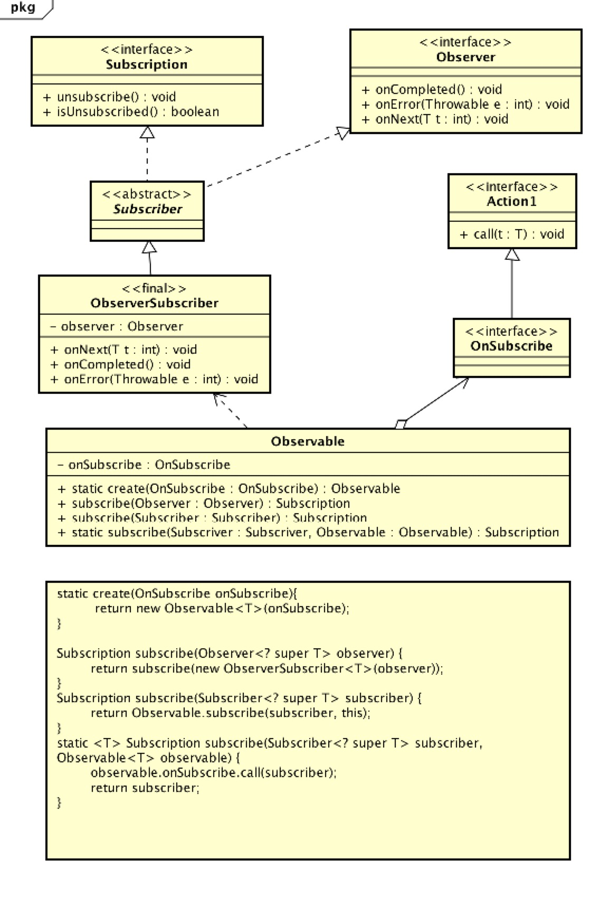
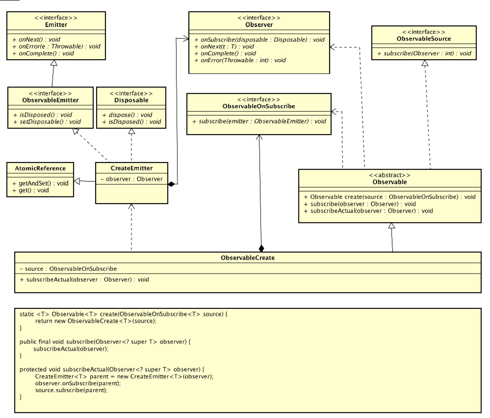
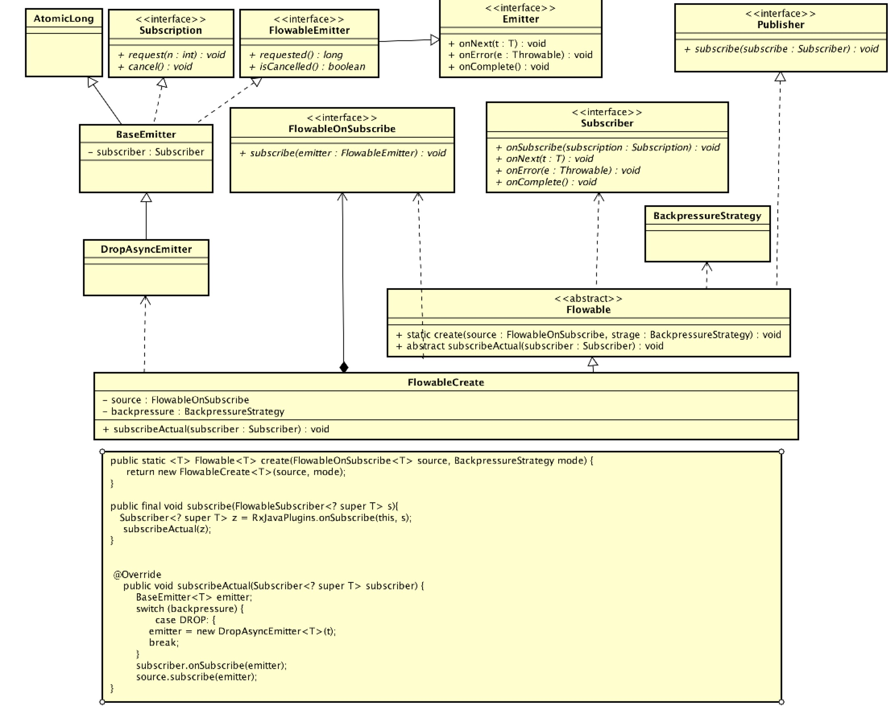

##RxJava简介

    A library for composing asynchronous and event-based programs by using observable sequences.
    
*Asynchronous*
1. 异步的，RxJava是一个异步的库。 
2. 基于回调的

*Event-base*
1. 基于事件的。
2. 事件分发的库和消息传递的库

##RxJava1中的基本元素
+ Observable
+ Observer
+ Subscription
+ OnSubscribe
+ Subscriber

    Observable 观察得到的是被观察者。通过它创建一个可观察的序列。通过subscribe去注册一个观察者
    
    Observer  用于接受数据是观察者。作为Observable的subscribe方法的参数。
    
    Subscription 订阅，用户描述被观察者和观察者之间的关系。用于取消订阅和获取当前订阅的状态。
    
    OnSubscribe 当订阅时会触发此接口调用。主要是向订阅者发送数据。
    
    Subscriber  实现了Observer和Subscription接口。
    

 
##背压的概念
1. 异步环境下产生的问题。
2. 发送和处理速度不统一。生产者的生产送速度大于消费者的消费速度，可能造成缓存队列溢出。
3. 是一种流速控制解决策略。

##RxJava2中的基本元素
+ Observable & Flowable
+ Observer & Subscriber
+ Disposable & Subscription
+ 相应的OnSubscribe
+ Emitter

###无背压基本元素

    Observable 被观察者，不支持背压。通过Observable创建一个可观察的序列。通过subscribe去注册一个观察者
    
    Observer  用于接受数据是观察者。作为Observable的subscribe方法的参数
    
    Displsable 和RxJava1的Subscription作用相当。
    
    ObservableOnSubscribe 和Rxjava1的OnSubscribe。当订阅时会触发此接口调用。主要是向订阅者发送数据。
    
    Emitter 一个发射数据的接口，和Observer的方法类似。
    

    

###有背压基本元素

    Flowable
    
    Subscriber
    
    Subscription
    
    OnSubscribe
    
    Emitter
    

##操作符的简介
+ 就是将发出的数据进行处理并再发送
+ 变化的原理依赖于-lift操作符。

###RxJava1中的操作符
1. Func1接口
2. Operator接口

Operator接口是操作符的抽象接口，各操作符实现Operator接口用于处理具体的变换

###RxJava1操作符原理
 
lift操作符 是变化的基本原理。各操作符实现Operator接口，并调用lift操作符。

+ 接收原OnSubscribe 和 Operator

    
    public final <R> Observable<R> lift(final Operator<? extends R, ? super T> operator) {
         return unsafeCreate(new OnSubscribeLift<T, R>(onSubscribe, operator));
    }
    
+ 创建一个新的OnSubscribe并返回新的Observable 

     
     public final class OnSubscribeLift<T, R> implements OnSubscribe<R> {
         final OnSubscribe<T> parent;
         final Operator<? extends R, ? super T> operator;
         public OnSubscribeLift(OnSubscribe<T> parent, Operator<? extends R, ? super T> operator) {
             this.parent = parent;
             this.operator = operator;
         }
         @Override
         public void call(Subscriber<? super R> o) {
             Subscriber<? super T> st = RxJavaHooks.onObservableLift(operator).call(o);
             parent.call(st);
         }
     }
     
     public static <T> Observable<T> unsafeCreate(OnSubscribe<T> f) {
         return new Observable<T>(RxJavaHooks.onCreate(f));
     }
     本质上是用Observable中的OnSubscribe调用Subscriber.
     
+ 用新的Subscriber包裹旧的Subscriber

    
     @Override
     public void call(final Subscriber<? super R> o) {
         MapSubscriber<T, R> parent = new MapSubscriber<T, R>(o, transformer);
         o.add(parent);
         source.unsafeSubscribe(parent);
     }
     
     static final class MapSubscriber<T, R> extends Subscriber<T> {
         final Subscriber<? super R> actual;
         final Func1<? super T, ? extends R> mapper;
         public MapSubscriber(Subscriber<? super R> actual, Func1<? super T, ? extends R> mapper) {
             this.actual = actual;
             this.mapper = mapper;
         }
 
         @Override
         public void onNext(T t) {
             R result = mapper.call(t);
             actual.onNext(result);
         }
 
         @Override
         public void onError(Throwable e) {
             actual.onError(e);
         }
         @Override
         public void onCompleted() {
             actual.onCompleted();
         }
     }

+ 在新的Subscriber中做变换，在传给旧的Subscriber

###RxJava2中的操作符
1. Function接口
2. AbstractObservableWithUpstream抽象类

###RxJava2操作符原理

无背压版本的实现方式：

+ 继承AbstractObservableUpstream

    public final <R> Observable<R> map(Function<? super T, ? extends R> mapper) {
       return new ObservableMap<T, R>(this, mapper);
    }
    
    abstract class AbstractObservableWithUpstream<T, U> extends Observable<U> implements HasUpstreamObservableSource<T> {
        protected final ObservableSource<T> source;
        AbstractObservableWithUpstream(ObservableSource<T> source) {
            this.source = source;
        }
    }
    
    public final class ObservableMap<T, U> extends AbstractObservableWithUpstream<T, U> {
        final Function<? super T, ? extends U> function;
        public ObservableMap(ObservableSource<T> source, Function<? super T, ? extends U> function) {
            super(source);
            this.function = function;
        }
    }
        
+ 利用其subscribeActual方法

    @Override
    public void subscribeActual(Observer<? super U> t) {
        source.subscribe(new MapObserver<T, U>(t, function));
    }
    
+ 用原Observable去subscribe变换后的Observer

    public abstract class BasicFuseableObserver<T, R> implements Observer<T>, QueueDisposable<R> {
       protected final Observer<? super R> actual;
       public BasicFuseableObserver(Observer<? super R> actual) {
           this.actual = actual;
       }
    }
    static final class MapObserver<T, U> extends BasicFuseableObserver<T, U> {
        final Function<? super T, ? extends U> mapper;

        MapObserver(Observer<? super U> actual, Function<? super T, ? extends U> mapper) {
            super(actual);
            this.mapper = mapper;
        }
        @Override
        public void onNext(T t) {
            U v = mapper.apply(t)
            actual.onNext(v);
        }
    }
    

有背压版本的实现方式：

+ 继承自AbstractFlowableWithUpstream

    public final <R> Flowable<R> map(Function<? super T, ? extends R> mapper) {
       return new FlowableMap<T, R>(this, mapper);
    }
    abstract class AbstractFlowableWithUpstream<T, R> extends Flowable<R> implements HasUpstreamPublisher<T> {
        protected final Flowable<T> source;
        AbstractFlowableWithUpstream(Flowable<T> source) {
            this.source = ObjectHelper.requireNonNull(source, "source is null");
        }
    }
    public final class FlowableMap<T, U> extends AbstractFlowableWithUpstream<T, U> {
        final Function<? super T, ? extends U> mapper;
        public FlowableMap(Flowable<T> source, Function<? super T, ? extends U> mapper) {
            super(source);
            this.mapper = mapper;
        }
    }
+ 利用其subscribeActual方法

    @Override
    protected void subscribeActual(Subscriber<? super U> s) {
         source.subscribe(new MapSubscriber<T, U>(s, mapper));
    }
        
+ 用原Flowable去subscribe变换后的subscriber

    public abstract class BasicFuseableSubscriber<T, R> implements FlowableSubscriber<T>, QueueSubscription<R> {
        protected final Subscriber<? super R> actual;
         public BasicFuseableSubscriber(Subscriber<? super R> actual) {
            this.actual = actual;
        }
    }
    
    static final class MapSubscriber<T, U> extends BasicFuseableSubscriber<T, U> {
        final Function<? super T, ? extends U> mapper;

        MapSubscriber(Subscriber<? super U> actual, Function<? super T, ? extends U> mapper) {
            super(actual);
            this.mapper = mapper;
        }
        @Override
        public void onNext(T t) {
            U v = ObjectHelper.requireNonNull(mapper.apply(t), "The mapper function returned a null value.");
            actual.onNext(v);
        }
    }
    
###Operator接口

1. 实现此接口 

     public final <R> Observable<R> lift(ObservableOperator<? extends R, ? super T> lifter) {
        return new ObservableLift<R, T>(this, lifter);
     }
     public interface ObservableOperator<Downstream, Upstream> {
         @NonNull
         Observer<? super Upstream> apply(@NonNull Observer<? super Downstream> observer) throws Exception;
     }
     
     public final class ObservableLift<R, T> extends AbstractObservableWithUpstream<T, R> {
         final ObservableOperator<? extends R, ? super T> operator;
     
         public ObservableLift(ObservableSource<T> source, ObservableOperator<? extends R, ? super T> operator) {
             super(source);
             this.operator = operator;
         }
     }

    
2. 在subscribeActual中做变换

     @Override
     public void subscribeActual(Observer<? super R> observer) {
         Observer<? super T> liftedObserver = operator.apply(observer);
         source.subscribe(liftedObserver);
     }
     
     
3. 用于扩展自定义操作符
